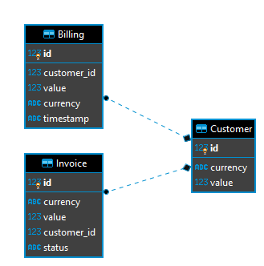

## Antaeus

Antaeus (/ænˈtiːəs/), in Greek mythology, a giant of Libya, the son of the sea god Poseidon and the Earth goddess Gaia. He compelled all strangers who were passing through the country to wrestle with him. Whenever Antaeus touched the Earth (his mother), his strength was renewed, so that even if thrown to the ground, he was invincible. Heracles, in combat with him, discovered the source of his strength and, lifting him up from Earth, crushed him to death.

Welcome to our challenge.

## The challenge

As most "Software as a Service" (SaaS) companies, Pleo needs to charge a subscription fee every month. Our database contains a few invoices for the different markets in which we operate. Your task is to build the logic that will schedule payment of those invoices on the first of the month. While this may seem simple, there is space for some decisions to be taken and you will be expected to justify them.

## Instructions

Fork this repo with your solution. Ideally, we'd like to see your progression through commits, and don't forget to update the README.md to explain your thought process.

Please let us know how long the challenge takes you. We're not looking for how speedy or lengthy you are. It's just really to give us a clearer idea of what you've produced in the time you decided to take. Feel free to go as big or as small as you want.

## Developing

Requirements:
- \>= Java 11 environment

### Building

```
./gradlew build
```

### Running

There are 2 options for running Anteus. You either need libsqlite3 or docker. Docker is easier but requires some docker knowledge. We do recommend docker though.


*Running through docker*

Install docker for your platform

```
make docker-run
```

*Running Natively*

Native java with sqlite (requires libsqlite3):

If you use homebrew on MacOS `brew install sqlite`.

```
./gradlew run
```


### App Structure
The code given is structured as follows. Feel free however to modify the structure to fit your needs.
```
├── pleo-antaeus-app
|       main() & initialization
|
├── pleo-antaeus-core
|       This is probably where you will introduce most of your new code.
|       Pay attention to the PaymentProvider and BillingService class.
|
├── pleo-antaeus-data
|       Module interfacing with the database. Contains the database models, mappings and access layer.
|
├── pleo-antaeus-models
|       Definition of the "rest api" models used throughout the application.
|
├── pleo-antaeus-rest
|        Entry point for REST API. This is where the routes are defined.
└──
```

### Main Libraries and dependencies
* [Exposed](https://github.com/JetBrains/Exposed) - DSL for type-safe SQL
* [Javalin](https://javalin.io/) - Simple web framework (for REST)
* [kotlin-logging](https://github.com/MicroUtils/kotlin-logging) - Simple logging framework for Kotlin
* [JUnit 5](https://junit.org/junit5/) - Testing framework
* [Mockk](https://mockk.io/) - Mocking library
* [Sqlite3](https://sqlite.org/index.html) - Database storage engine

Happy hacking 😁!

# Solution

### Design choices
I choose to have a designated table Billings in the database. 
In this table the Billing of each customer is stored for every month.
Even when a customer have zero expenses a billing is created for logging and archiving purposes.


##Components
 
### Models
The Model Layer 

* Invoice
    * id
    
* Customer
    * id
    * balance
        * value
        * currency
* Billing
    * id
    * customerId
    * totalAmount
        * value
        * currency

### Data Access Layer
The AntaeusDal is divided into three different DAL files, each for every db table.

### Database 
The EER diagram of the Antaeus Database:



###BillingService

### Scheduler

###CurrencyConverter

###BillingServicePaymentProvider
 On payment day (1st of each month at 12:00) for every customer all the pending invoices are checked. If the customer have enough balance, he is charged. 
 The invoice status is changed to PAID and the value of the invoice is removed from his balance.


### REST API
The second version (v2) of the api was implemented. The new api calls are:

* **POST:**
    ```
    /v2/payments       //iniate monthly payment(billing) service for all customers
    /v2/payments/{id}  //iniate monthly payment(billing) service for customer with specific id
  ```
* **GET:**
    ```
    /v2/billings        //get all billings that have been printed
    /v2/billings/{id}   //get billing with specific id
  ```


## Testing
Both unit and integration tests implemented
Almost every function of the core module has its own unit test.
 

##Conclusion
Antaeus was pretty mighty but as he couldn't beat Hercules, he couldn't run away from the even mightier Pleo's payment service. 
At the first of every month he has to pay his pending invoices!
